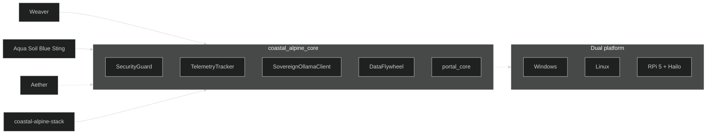

# coastal-alpine-core - Architecture

## Purpose
This package is the single shared foundation for Coastal Alpine Tech's edge AI and portal systems. It contains reusable logic for security, telemetry, local LLM access, and the common portal framework used across AquaGuard, SoilGuard, and Blue-Moon.

## Key Rules
- All shared code must live in this repository.
- Portals must depend on **tagged releases only** (e.g. `v0.3.0`). Never pin to `main`.
- Changes to `portal_core/` affect multiple production systems - coordinate before modifying core interfaces.
- Version bumps and releases are managed through the automated GitHub Actions workflow.

## Current Structure
- `src/coastal_alpine_core/portal_core/` - Shared portal logic (config, capture, MQTT, hardware control, pruning, AI agent, compliance)
- `src/coastal_alpine_core/` - Core security, telemetry, and Ollama client

## Versioning & Releases
- Semantic versioning via `pyproject.toml`
- Automated releases triggered on pushed tags (e.g., `v0.4.0`)
- Portals must pin to tagged versions (e.g. `@v0.4.0`), never `@main`

## Dependency Policy
All downstream portals should depend on tagged releases of this package only.

## Release Process
1. Make changes and update version in `pyproject.toml`
2. Push changes to `main`
3. Tag the release and push the tag:
 ```bash
 git tag v0.4.0
 git push origin v0.4.0
 ```
4. GitHub Actions automatically builds and creates a release based on the pushed tag
5. Dependabot will open PRs in the portals to update the pin
5. Portal CI will verify against the new core version

## Hybridisation (Kiwi Edge)

Coastal-Alpine-Core is the shared foundation hybridised across:

| Consumer | Integration |
| :--- | :--- |
| **Weaver** | Guards, tenant isolation helpers, Ollama client, telemetry on routing paths |
| **Domain portals** | `portal_core` (AIAgent, MQTT, AV, Hardware), DataFlywheel |
| **Aether** | Architecture / sovereignty skills; companion for HITL and remediation |
| **coastal-alpine-stack** | Editable workspace package for compose/K3s monorepo |



## Dual-platform development

| Host | Installer | Notes |
| :--- | :--- | :--- |
| **Linux / macOS** | `install.sh` | `python3-venv`, optional `uv` |
| **Windows** | `install.ps1` | PowerShell; Git + Python on PATH |
| **RPi 5 edge** | same as Linux | + Hailo runtime for NPU vision portals |

See [DEVELOPER_SETUP.md](./DEVELOPER_SETUP.md) and [README.md](./README.md).

## Local Development

### Linux / macOS

```bash
# Recommended
uv sync
uv run pytest
ruff check .
ruff format .

# Or pip
python3 -m venv .venv && source .venv/bin/activate
pip install -e ".[dev]"
pytest
```

### Windows (PowerShell)

```powershell
python -m venv .venv
.\.venv\Scripts\Activate.ps1
pip install -e ".[dev]"
pytest
ruff check .
```
