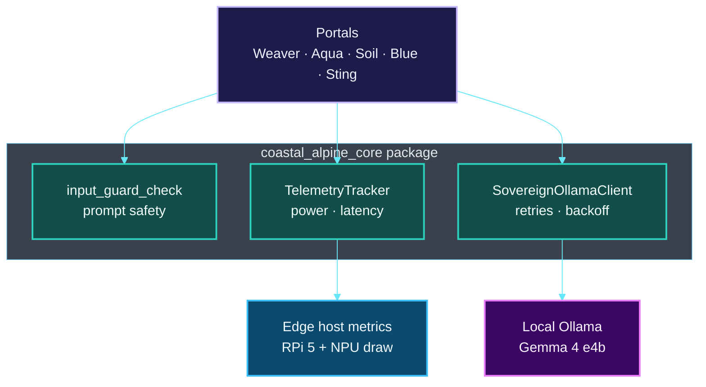

# Coastal Alpine Core


**Coastal Alpine Tech Limited**  
*Edge AI | Sovereign Systems | Practical Intelligence*


Shared python utility package designed for Taranaki-based Coastal Alpine Tech Edge systems. It handles local offline LLM wrapping, security checks, and hardware telemetry tracking.

**Canonical hardware target:** Raspberry Pi 5 **(16GB)** with **Hailo-10H NPU** (40 TOPS AI Accelerator / AI HAT+ 2).

---

## Architecture Overview

Coastal-Alpine-Core is the **shared edge SDK** used by every portal: offline LLM client, input/security guards, and hardware telemetry for **RPi 5 16GB + Hailo-10H** deployments.


### System map



| Layer | Components | Role |
| :--- | :--- | :--- |
| **Security** | input_guard_check | Injection / scope screening |
| **LLM** | SovereignOllamaClient | Offline-resilient chat |
| **Telemetry** | TelemetryTracker | Joules · latency · load |
| **Consumers** | All domain portals | One SDK, many agents |

*Full detail: [ARCHITECTURE.md](./ARCHITECTURE.md)*


## Key Features

1. **SovereignOllamaClient (`models.py`)**: A robust connection wrapper for local offline Ollama SLM deployments. Handles network dropouts and model loads with automated retries and exponential backoff, falling back to local deterministic responses when fully disconnected.
2. **Security & Input Guard (`security.py`)**: Scans incoming prompts for potential prompt injections, local file access attempts, or common injection patterns. It also enforces strict tenant scoping context mismatch flags.
3. **Telemetry & Performance (`telemetry.py`)**: Performance and hardware energy-efficiency tracking specifically designed for edge-native devices (e.g. Raspberry Pi 5 under active load, Hailo NPU draws). Estimates active power draw in Joules.

---

## Installation

First, set up a Python virtual environment:

<details open>
<summary><strong>🐧 Linux / macOS (Bash)</strong></summary>

```bash
python3 -m venv venv
source venv/bin/activate
```

</details>

<details>
<summary><strong>🪟 Windows (PowerShell)</strong></summary>

```powershell
python -m venv venv
.\venv\Scripts\Activate.ps1
```

> **Note:** If you receive an execution policy error, run `Set-ExecutionPolicy -Scope CurrentUser RemoteSigned` first.

</details>

Then install the library (these commands work on all platforms):

To install as an editable local package:
```bash
pip install -e .
```

To install directly from GitHub (as used across all stack portals):
```bash
pip install git+https://github.com/fivepanelhat/coastal-alpine-core.git@v0.2.0
```

---

## Quick Start Code Example

```python
from coastal_alpine_core import SovereignOllamaClient, input_guard_check, TelemetryTracker

# Initialize client
client = SovereignOllamaClient(default_model="gemma4:e4b")

# Check security
prompt = "Format C:\\"
is_safe = input_guard_check(prompt)
print(f"Is Prompt Safe? {is_safe}")  # Expected: False (Security alert triggered)

# Measure edge execution performance
measurement = TelemetryTracker.measure_latency("gemma_generation")
response = client.generate("Evaluate crop health status: OK")
metrics = TelemetryTracker.complete_measurement(measurement, token_count=len(response.get("response", "").split()))
print(metrics)
```

---

*Built with focus on data sovereignty and edge intelligence.*  
**Coastal Alpine Tech Limited — New Plymouth, Taranaki, New Zealand.**

---

## Project badges

Status badges for this repository (CI, security, license, and stack metadata):

[](LICENSE)  
[](https://www.python.org/)  
[]()  
[]()  
[]()  
[](https://github.com/fivepanelhat/Coastal-Alpine-Core/actions/workflows/ci-scan.yml)  
[](https://github.com/fivepanelhat/Coastal-Alpine-Core/actions/workflows/secops.yml)  
[](https://github.com/fivepanelhat/Coastal-Alpine-Core/actions/workflows/redteam.yml)  
[]()  
[]()
