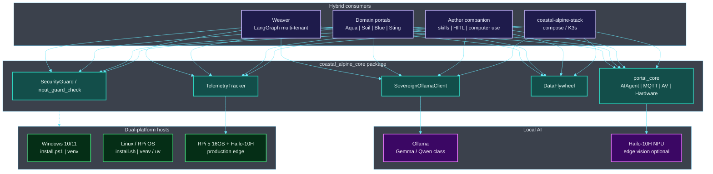

# Coastal Alpine Core

<!-- BEGIN CAT_CONGRUENCE_SNIPPET -->
## Coastal Alpine Tech portfolio

[](https://github.com/fivepanelhat/fivepanelhat)
[](https://github.com/fivepanelhat/fivepanelhat)
[](./.github/agent-fleet/AGENTS.md)
[](https://github.com/fivepanelhat/fivepanelhat)

**Part of the [Kiwi Edge AI Stack](https://github.com/fivepanelhat/fivepanelhat)** | Founder OS: [NZ-Start-Up](https://github.com/fivepanelhat/NZ-Start-Up) | Agent policy: [`.github/agent-fleet/`](./.github/agent-fleet/)

> Sovereign hybrid edge AI for NZ farms and founders - local-first + multi-model, Te Mana Raraunga aligned - collaborating with Venture Taranaki, startups.com investors and Kotahitanga Investment Fund (HITL + cultural advisory for formal approaches).

**Agents inform, draft, prepare, monitor, and remind. Humans advise, sign, file, send, and pay.** 
Anti-hallucination policy: [`.github/agent-fleet/anti-hallucination.md`](./.github/agent-fleet/anti-hallucination.md) | Congruence: [`CAT_CONGRUENCE.md`](./CAT_CONGRUENCE.md)
<!-- END CAT_CONGRUENCE_SNIPPET -->

<!-- BEGIN PROBLEMS_SOLUTIONS_ECONOMY -->
## Problems we are solving

**Coastal-Alpine-Core** is the shared edge SDK so every portal does not reinvent security, telemetry, and local LLM wiring.

1. **Duplicated edge plumbing** - Each agritech portal re-building MQTT, Ollama, and guards wastes scarce NZ engineering time.
2. **Inconsistent security posture** - Fragmented crypto and device assumptions fail rural and procurement scrutiny.
3. **Weak offline defaults** - Libraries written for cloud-first stacks break on RPi field nodes.
4. **No common audit spine** - Compliance exports and fail-closed patterns must be shared IP, not one-off scripts.

## Solution we have built

| Built capability | What it does |
| :--- | :--- |
| **Shared SDK** | Guards, telemetry, Ollama helpers, portal_core primitives |
| **Edge target** | Canonical **RPi 5 16GB + Hailo-10H** assumptions |
| **Fail-closed patterns** | Security defaults suitable for pre-seed hardening toward Diamond targets |
| **Consumed by** | Byte Size Kai, SoilGuard, AquaGuard, stack, and related portals |

This is foundation IP: it multiplies every beachhead product without shipping a separate end-user app.

### Why this SDK is hard to replace

Most edge AI libraries stop at “run a model offline.”  
Coastal-Alpine-Core is designed as the measurement and learning substrate for a sovereign data flywheel:

- Every meaningful action can emit a structured trajectory (input summary, output, outcome, latency, energy).
- Human feedback and quality scores are first-class.
- Golden sets can be curated locally for continuous improvement without leaving the node.
- Telemetry is hardware-aware from day one (RPi 5 + Hailo power model).

This turns every deployed portal into a self-improving local system rather than a static inference endpoint. The combination of local trajectory capture, energy-aware measurement, and owner-controlled golden sets is part of the broader Coastal Alpine technical moat (see the portfolio [Technical Moat](https://github.com/fivepanelhat/fivepanelhat#technical-moat) section).

### Local (Taranaki) and national (Aotearoa) economic benefits

| Lever | Benefit |
| :--- | :--- |
| **Regional R&D HQ** | Product design and IP stay in New Plymouth / Taranaki - not only Auckland/offshore SaaS |
| **Primary-sector productivity** | On-farm and rural tools aim to cut waste, protect consents, and support export competitiveness |
| **Skilled employment pathways** | Edge install, field support, agritech ops, software, compliance, and cultural advisory roles as pilots scale |
| **Data sovereignty** | Te Mana Raraunga-aligned local custody keeps high-value operational data onshore |
| **HITL jobs quality** | Agents **inform / draft / prepare / monitor / remind**; humans **advise / sign / file / send / pay** - augment people, do not fake full autonomy |

**Stage honesty (pre-seed):** Impact today is founder R&D, near-term contractors, and EDA/partner leverage. Permanent multi-region payroll follows paid pilots and revenue - we do not invent headcount claims.
<!-- END PROBLEMS_SOLUTIONS_ECONOMY -->

[](./LICENSE)
[](https://www.python.org)
[](./CHANGELOG.md)

[](https://github.com/fivepanelhat/Coastal-Alpine-Core)
[](https://github.com/fivepanelhat/Coastal-Alpine-Core)
[](https://github.com/fivepanelhat/Coastal-Alpine-Core)
[](https://github.com/fivepanelhat/Coastal-Alpine-Core)

[](https://anthropic.com)
[](https://gemini.google.com)
[](https://openai.com)
[](https://x.ai)

[](https://github.com/fivepanelhat/Coastal-Alpine-Core)
[](./ARCHITECTURE.md)
[](https://ollama.ai)

[](https://github.com/fivepanelhat/Coastal-Alpine-Core/actions/workflows/ci-scan.yml)
[](https://github.com/fivepanelhat/Coastal-Alpine-Core/actions/workflows/secops.yml)
[](https://github.com/fivepanelhat/Coastal-Alpine-Core/security/dependabot)


**Coastal Alpine Tech Limited** pre-seed startup, New Plymouth, Taranaki, Aotearoa New Zealand.
*Edge AI | Sovereign Systems | Practical Intelligence*

Shared python utility package designed for Taranaki-based Coastal Alpine Tech Edge systems. It handles local offline LLM wrapping, security checks, and hardware telemetry tracking.

**Canonical hardware target:** Raspberry Pi 5 **(16GB)** with **Hailo-10H NPU** (40 TOPS AI Accelerator / AI HAT+ 2).

---

## Architecture Overview

> **Diagrams:** Architecture images and Mermaid maps describe the **target product architecture** for this pre-seed stack. They are engineering design maps not claims of large-scale commercial fleet deployment.

Coastal-Alpine-Core is the **shared edge SDK** used by every portal: offline LLM client, input/security guards, and hardware telemetry for **RPi 5 16GB + Hailo-10H** deployments.


### System map



 | Layer | Components | Role |
 | :--- | :--- | :--- |
 | **Security** | SecurityGuard / input_guard_check | Injection / scope screening |
 | **LLM** | SovereignOllamaClient | Offline-resilient chat |
 | **Telemetry** | TelemetryTracker | Joules | latency | load |
 | **Flywheel** | DataFlywheel | Trajectories | golden sets |
 | **Portal kit** | portal_core | MQTT | AV | hardware loop |
 | **Consumers** | Weaver | portals | Aether | stack | One SDK, hybridised stack |
 | **Hosts** | Windows | Linux | RPi 5 | Dev on Win/Linux; deploy on edge |

*Full detail: [ARCHITECTURE.md](./ARCHITECTURE.md) | [DEVELOPER_SETUP.md](./DEVELOPER_SETUP.md)*

## Key Features

1. **SovereignOllamaClient (`ollama_client.py`)**: A robust connection wrapper for local offline Ollama SLM deployments. Handles network dropouts and model loads with automated retries and exponential backoff, falling back to local deterministic responses when fully disconnected.
2. **Security & Input Guard (`security.py`)**: Scans incoming prompts for potential prompt injections, local file access attempts, or common injection patterns. It also enforces strict tenant scoping context mismatch flags.
3. **Telemetry & Performance (`telemetry.py`)**: Performance and hardware energy-efficiency tracking specifically designed for edge-native devices (e.g. Raspberry Pi 5 under active load, Hailo NPU draws). Estimates active power draw in Joules.
4. **DataFlywheel**: Structured trajectory recording, human feedback attachment, golden-set curation, and SD-card-safe rotation. Enables continuous local improvement under owner control.

---

## Installation

**Platforms:** Windows 10/11 | Linux (Ubuntu/Debian/RPi OS) | macOS | production edge on **RPi 5 16GB + Hailo-10H**.

### One-line install (recommended)

<details open>
<summary><strong> Linux / macOS</strong></summary>

```bash
curl -fsSL https://raw.githubusercontent.com/fivepanelhat/Coastal-Alpine-Core/main/install.sh | bash
```

</details>

<details>
<summary><strong> Windows (PowerShell)</strong></summary>

```powershell
irm https://raw.githubusercontent.com/fivepanelhat/Coastal-Alpine-Core/main/install.ps1 | iex
```

> **Note:** If script execution is blocked: `Set-ExecutionPolicy -Scope CurrentUser RemoteSigned`

</details>

### Manual install

<details open>
<summary><strong> Linux / macOS (Bash)</strong></summary>

```bash
git clone https://github.com/fivepanelhat/Coastal-Alpine-Core.git
cd Coastal-Alpine-Core
python3 -m venv .venv
source .venv/bin/activate
pip install -U pip
pip install -e ".[dev]"
# optional (uv):
# uv sync && uv run pytest
```

**System packages (Debian/Ubuntu/RPi OS):**

```bash
sudo apt-get update
sudo apt-get install -y python3-dev python3-venv python3-pip git build-essential
```

</details>

<details>
<summary><strong> Windows (PowerShell)</strong></summary>

```powershell
git clone https://github.com/fivepanelhat/Coastal-Alpine-Core.git
cd Coastal-Alpine-Core
python -m venv .venv
.\.venv\Scripts\Activate.ps1
python -m pip install -U pip
pip install -e ".[dev]"
```

**Prerequisites:** [Python 3.10+](https://www.python.org/downloads/) with "Add Python to PATH", [Git for Windows](https://git-scm.com/).

</details>

### Pin from GitHub (portals / CI)

Use a **tagged release** only (never `@main`):

```bash
pip install "git+https://github.com/fivepanelhat/Coastal-Alpine-Core.git@v0.5.4"
```

---

## Quick Start Code Example

```python
from coastal_alpine_core import SovereignOllamaClient, input_guard_check, TelemetryTracker

# Initialize client
client = SovereignOllamaClient(default_model="gemma4:e4b")

# Check security
prompt = "Format C:\\"
is_safe = input_guard_check(prompt)
print(f"Is Prompt Safe? {is_safe}") # Expected: False (Security alert triggered)

# Measure edge execution performance
measurement = TelemetryTracker.measure_latency("gemma_generation")
response = client.generate("Evaluate crop health status: OK")
metrics = TelemetryTracker.complete_measurement(measurement, token_count=len(response.get("response", ).split()))
print(metrics)
```

---

*Built with focus on data sovereignty and edge intelligence.*
**Coastal Alpine Tech Limited New Plymouth, Taranaki, New Zealand.**
